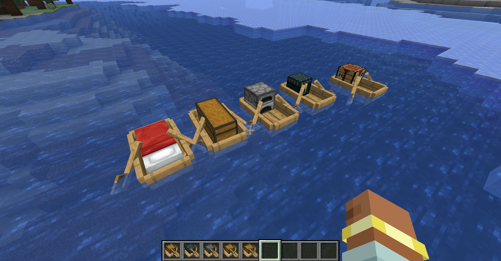

# Better than Boats

[](https://minecraft.net)
[](https://neoforged.net)
[](https://www.gnu.org/licenses/gpl-3.0.html)
[](https://semver.org/)

A Minecraft mod that introduces 5 new boat variants, allowing you to transform the open water into your permanent, mobile base. Built for **NeoForge**, this mod lets you assemble a fully equipped water caravan. Seamlessly transport massive amounts of cargo and craft on the go during long-distance journeys, completely eliminating the need to ever drop anchor or build on land.



## Features

This mod adds the following functional boat variants to the game:

1. **Boat with Crafting Table:** Craft items on the go without leaving your vessel.
2. **Boat with Furnace:** Smelt ores and cook food while sailing across oceans.
3. **Boat with Double Chest:** Offers massive inventory space for long-distance resource transport. *Note: This boat is not ridable, but you can link it to your other boats using a Lead.*
4. **Boat with Bed:** Sleep on the water and set a persistent, mobile spawn point during long voyages. Full details in the section below. *Note: This boat is not ridable during normal travel, but you can link it to other boats using a Lead.*
5. **Boat with Ender Chest:** Access your global Ender inventory securely from anywhere in the world.

## Boat with Bed — Spawn Mechanics

The Boat with Bed functions as a fully mobile respawn point. Here is the complete breakdown of its behavior:

### Setting Your Spawn
Right-clicking the Boat with Bed at any time of day sets your spawn point to the boat's current position, even when it is not yet night and sleeping is not possible. You will see the standard spawn-set toast notification.

### Sleeping
When it is night and no monsters are nearby, right-clicking initiates sleep as normal. While you are sleeping, the boat keeps your sleep validity position and respawn position updated every tick as the boat moves, so waves or a lead pull will not break the sleep.

### Mobile Spawn Tracking
The boat remembers every player whose spawn point is linked to it. Every 10 ticks (0.5 seconds) it pushes its current block position to all online linked players as their active respawn position. This means the stored spawn point continuously follows the boat as it drifts or is towed, without any action required from the player.

If a player links their spawn to a different Boat with Bed, the old boat automatically removes them from its tracking list on the next update cycle.

### Death and Respawn
On death the mod searches for the linked Boat with Bed in this order:
1. The chunk at the stored respawn position is force-loaded and the boat is searched within 8 blocks.
2. If not found there (the boat drifted), the boat is looked up directly by its saved UUID.
3. If the boat's chunk is unloaded and the entity cannot be resolved, the player respawns at the last position the boat was seen — still the correct ocean location rather than world spawn.

### Unlinking From the Boat
The boat UUID link is cleared automatically when:
- The player right-clicks and sleeps in a normal land-based bed, which takes over as the active respawn point.
- The player's spawn point is reset by any other means (e.g., `/spawnpoint` with no arguments).

### Dimension Behavior
Matches vanilla bed rules per dimension. In the Nether and End the boat explodes on right-click, identical to placing a regular bed there.

## Mixins

This mod introduces two mixins:
- **`LivingEntityMixin`** — disables the block-existence check that vanilla runs each tick for sleeping entities, since the Boat with Bed is an entity rather than a block. Standard beds are unaffected.
- **`ServerPlayerMixin`** — intercepts the "missing respawn block" transition during respawn and redirects the player to the linked Boat with Bed if one is found, preventing the vanilla "bed missing" message and world-spawn fallback.

## Installation

1. Make sure you have the correct version of **NeoForge** installed.
2. Download the mod `.jar` file.
3. Place the downloaded file into your Minecraft `mods` folder.
4. Launch the game using the NeoForge profile.

## Development & Building

If you want to compile the project yourself, follow these steps:

### Prerequisites
* Java Development Kit (JDK) compatible with Minecraft 26.1.2.

### Build Commands
Run the following commands in your terminal or command prompt:
```bash
# Windows
gradlew.bat build

# Linux / macOS
./gradlew build
```